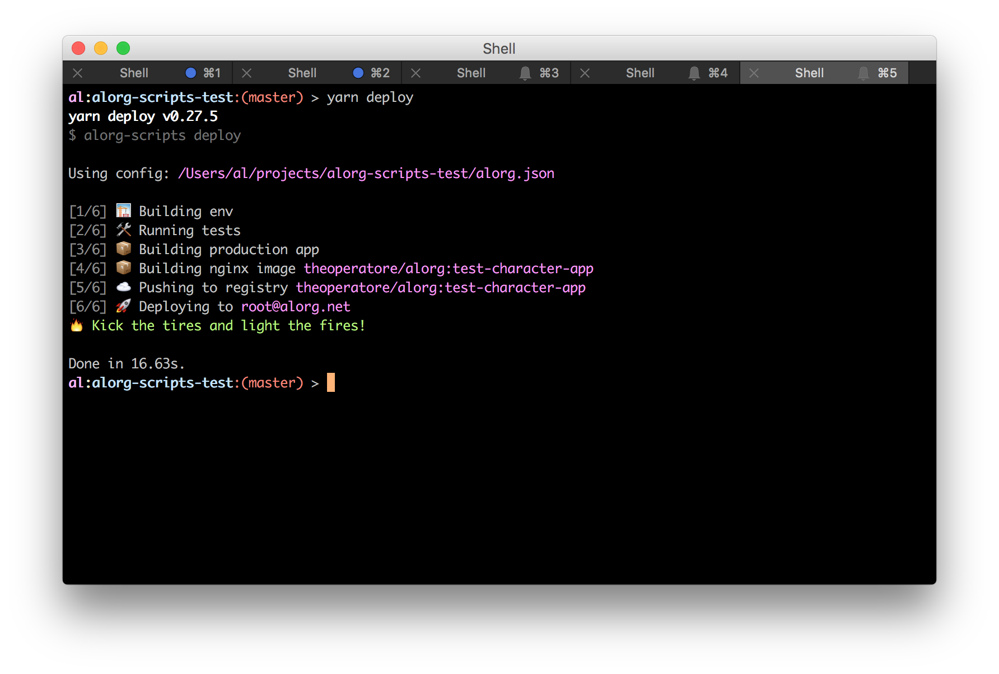

# alorg-scripts

Examples of how we could deploy single-page applications via cli tool.

Invoked exactly the same as [react-scripts]():

```bash
# run via: yarn deploy
alorg-scripts deploy
```

yields:



# Configuration

Right now it's based off of an `alorg.json` file:

```json
{
  "name": "some name",
  "registry": "theoperatore/alorg",
  "tag": "latest",
  "servers": ["root@someplace.com"]
}
```

But this could just as easily be a `service.yaml` file or something else Spotify related.

# License

MIT
